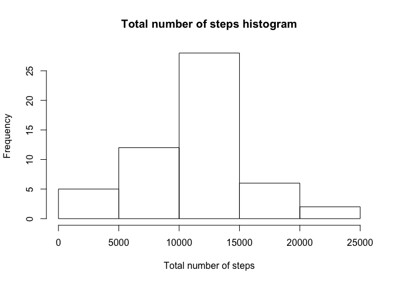
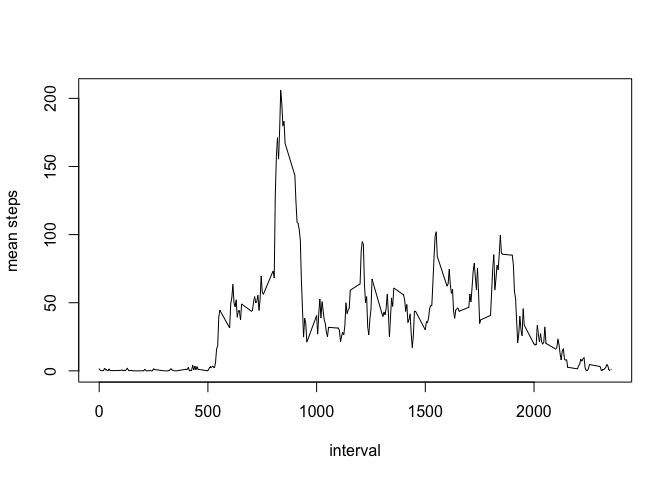
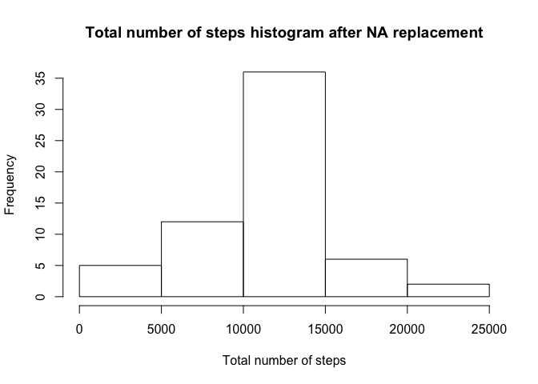

# Reproducible Research: Peer Assessment 1


## Loading and preprocessing the data
Package lattice is loaded to plot the final figure

```r
library("lattice")
activity<-read.csv(unzip("activity.zip"))
```


## What is mean total number of steps taken per day?
The R function aggregate give the result, but summing the steps over all dates.

###Make a histogram of the total number of steps taken each day
An histogram is drawn to have an idea of the distribution. 

```r
aggdata <-aggregate(steps~date, activity,FUN=sum, na.rm=TRUE)
hist(aggdata[,"steps"],xlab="Total number of steps",main="Total number of steps histogram")
```

<!-- -->

###Calculate and report the mean and median of the total number of steps taken per day
Finally the mean total number is computed and is equal to 10776.19. 

```r
mean(aggdata[,"steps"])
```

```
## [1] 10766.19
```

```r
median(aggdata[,"steps"])
```

```
## [1] 10765
```


## What is the average daily activity pattern?

###Make a time series plot of the 5-minute interval and the average number of steps taken, averaged across all days
Again the R function gives the answer, but this time, the main variable is not date, but the interval, hence we compute the mean step over all the possible days, and plot it as a time serie for each interval.

```r
aggdata2 <-aggregate(steps~interval, activity,FUN=mean, na.rm=TRUE)
plot(aggdata2,type="l",ylab="mean steps")
```

<!-- -->

###Which 5-minute interval, on average across all the days in the dataset, contains the maximum number of steps?
Here we compute the max interval, it is the interval 835


```r
max_interval=which(aggdata2[,"steps"]==max(aggdata2[,"steps"]))
aggdata2[max_interval,"interval" ]
```

```
## [1] 835
```


## Imputing missing values

###Calculate and report the total number of missing values in the dataset 
First we compte the number of NA values

```r
numberNA<- sum(is.na(activity))
numberNA
```

```
## [1] 2304
```
###Devise a strategy for filling in all of the missing values in the dataset. The strategy does not need to be sophisticated
The strategy we apply is the simplest: The activity dataframe will be replaced by the nactivity dataframe with Na Values for each interval replaced by mean step values over all the possible days we computed.

###Create a new dataset that is equal to the original dataset but with the missing data filled in.

```r
nactivity<-activity
f<-dim(activity)
for(i in 1:f[1]){
  current_line<-activity[i,]
  if(is.na(activity[i,"steps"])) {
  interval<-current_line[,"interval"]
  mean_step<-aggdata2[which(aggdata2[,"interval"]==interval),"steps"]
  nactivity[i,"steps"]<-mean_step}
}
```

###Make a histogram of the total number of steps taken each day. Do these values differ from the estimates from the first part of the assignment?
The analysis is done with this new data frame to the the difference.
The histogram is not quite the same and the mean value is differente, it is now 10766.19

```r
aggdata_clean <-aggregate(steps~date, nactivity,FUN=sum)
hist(aggdata_clean[,"steps"],xlab="Total number of steps",main="Total number of steps histogram after NA replacement")
```

<!-- -->

```r
mean(aggdata_clean[,"steps"])
```

```
## [1] 10766.19
```

```r
median(aggdata_clean[,"steps"])
```

```
## [1] 10766.19
```


## Are there differences in activity patterns between weekdays and weekends?

###Create a new factor variable in the dataset with two levels – “weekday” and “weekend”.
The function weekdays will help to identify two classes, the days of the weekend and the days of the weekday.

```r
week_day <- weekdays(as.Date(nactivity$date))
#my date system is in french : 
#lundi,mardi,mercredi,jeudi,vendredi 
#with samedi and dimanche for the week-end
type_day <- as.vector(nactivity$date)
for (i in 1:nrow(nactivity)) {
  if (week_day[i] == "Samedi" | week_day[i] == "Dimanche" ) {
    type_day[i] <- "weekend"
  } else {
    type_day[i] <- "weekday"
  }
}
```

###Make a panel plot containing a time series plot of the 5-minute interval and the average number of steps taken, averaged across all weekday days or weekend days 
We have now a new factor, the day class "weekday" or "weekend"
The function xy plot gives the answer by plotting two time series, with each day class label. We see that the actvity is quite different. During the week-end, much more activity is measured.

```r
nactivity$type_day <- as.factor(type_day)
steps_day <- aggregate(steps ~ interval + type_day, data = nactivity, mean)

xyplot(steps ~ interval | type_day, steps_day, type = "l", layout = c(1, 2), 
       xlab = "Interval", ylab = "Number of steps")
```

<!-- -->
